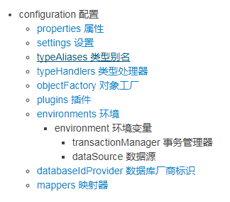

# Mybatis SqlSessionFactoryBuilder解析xml分析
---
在不考虑与Spring集成的情况下,使用MyBatis执行数据库操作的代码如下：
```java
// String resource = "org/mybatis/example/mybatis-config.xml";
// InputStream inputStream = Resources.getResourceAsStream(resource);
SqlSessionFactory sqlSessionFactory = new SqlSessionFactoryBuilder().build(inputStream);
SqlSession session = sqlSessionFactory.openSession();
// try {
  // Blog blog = session.selectOne("org.mybatis.example.BlogMapper.selectBlog", 101);
// } finally {
  // session.close();
}
```
这里new了一个SqlSessionFactoryBuilder，并调用build方法。这是解析配置文件中的内容，解析为Configuration对象，并以SqlSessionFactory的形式返回。我们看一下build方法：
```java
public SqlSessionFactory build(Reader reader, String environment, Properties properties) {
		try {
			XMLConfigBuilder parser = new XMLConfigBuilder(reader, environment,
					properties);
			//解析xml为Configuration对象，并且包装成SqlSessionFactory的形式返回
			return build(parser.parse());
		} catch (Exception e) {
			throw ExceptionFactory.wrapException("Error building SqlSession.", e);
		} finally {
			ErrorContext.instance().reset();
			try {
				reader.close();
			} catch (IOException e) {
				// Intentionally ignore. Prefer previous error.
			}
		}
}
```
这里先获得一个XMLConfigBuilder，再调用parse()方法解析xml，parse()方法如下：
```java
public Configuration parse() {
		// 如果已经解析过来，抛异常，不再解析
		if (parsed) {
			throw new BuilderException(
					"Each XMLConfigBuilder can only be used once.");
		}
		// 如果第一次解析，将标志置为true
		parsed = true;
		// parse.evalNode("/configuration")获得xml中的<configuration>结点
		parseConfiguration(parser.evalNode("/configuration"));
		return configuration;
}
```
通过parser.evalNode("/configuration")得到了<configuration>结点后调用parseConfiguration方法对configuration进行解析。下面是configuration结点的结构图：


```java
private void parseConfiguration(XNode root) {
		try {
			// issue #117 read properties first
      //解析properties结点
			propertiesElement(root.evalNode("properties"));
      //解析settings结点
			Properties settings = settingsAsProperties(root.evalNode("settings"));
			loadCustomVfs(settings);
			typeAliasesElement(root.evalNode("typeAliases"));
			pluginElement(root.evalNode("plugins"));
			objectFactoryElement(root.evalNode("objectFactory"));
			objectWrapperFactoryElement(root.evalNode("objectWrapperFactory"));
			reflectorFactoryElement(root.evalNode("reflectorFactory"));
			settingsElement(settings);
			// read it after objectFactory and objectWrapperFactory issue #631
			environmentsElement(root.evalNode("environments"));
			databaseIdProviderElement(root.evalNode("databaseIdProvider"));
			typeHandlerElement(root.evalNode("typeHandlers"));
			mapperElement(root.evalNode("mappers"));
		} catch (Exception e) {
			throw new BuilderException(
					"Error parsing SQL Mapper Configuration. Cause: " + e, e);
		}
}
```

这里看几个比较重要的解析方法

以下是properties结点的解析方法
```java
private void propertiesElement(XNode context) throws Exception {
		if (context != null) {
			// 获取properties结点下的所有子节点的属性名和属性值，并以Properties的形式返回
			Properties defaults = context.getChildrenAsProperties();
			// 获取外部文件
			String resource = context.getStringAttribute("resource");
			String url = context.getStringAttribute("url");
			if (resource != null && url != null) {
				throw new BuilderException(
						"The properties element cannot specify both a URL and a resource based property file reference.  Please specify one or the other.");
			}
			//将外部文件的属性名和属性值插入
			if (resource != null) {
				defaults.putAll(Resources.getResourceAsProperties(resource));
			} else if (url != null) {
				defaults.putAll(Resources.getUrlAsProperties(url));
			}
			// 找出已经存在的属性
			Properties vars = configuration.getVariables();
			if (vars != null) {
				defaults.putAll(vars);
			}
			// 设置属性
			parser.setVariables(defaults);
			configuration.setVariables(defaults);
		}
}
```
这是解析类别名的方法

```java
/**
	 * 解析别名
	 * @param parent
	 */
	private void typeAliasesElement(XNode parent) {
		if (parent != null) {
			for (XNode child : parent.getChildren()) {
				// 如果是配置了一个包名，会扫描包下所有需要的Java Bean。如果这些类没有注解，会使用类的简称（首字母变小写），如果有@Alias注解，使用注解中的名称
				if ("package".equals(child.getName())) {
					String typeAliasPackage = child.getStringAttribute("name");
					configuration.getTypeAliasRegistry().registerAliases(
							typeAliasPackage);
				} else {
					String alias = child.getStringAttribute("alias");
					String type = child.getStringAttribute("type");
					try {
						Class<?> clazz = Resources.classForName(type);
						if (alias == null) {
							// 判断是否有注解，没有注解用类简称（首字母小写），有@Alias，用注解中的名称
							typeAliasRegistry.registerAlias(clazz);
						} else {
							// 设置
							typeAliasRegistry.registerAlias(alias, clazz);
						}
					} catch (ClassNotFoundException e) {
						throw new BuilderException(
								"Error registering typeAlias for '" + alias
										+ "'. Cause: " + e, e);
					}
				}
			}
		}
}
```
在mybatis中，为了适用于不同的环境或是数据库，需要配置环境，比如开发环境，测试环境，演示环境，生产环境等等。那么这里就需要通过配置环境< environments>标签来区分这些不同的环境。配置文件示例如下：
```xml
<environments default="development">
  <environment id="development">
    <transactionManager type="JDBC">
      <property name="..." value="..."/>
    </transactionManager>
    <dataSource type="POOLED">
      <property name="driver" value="${driver}"/>
      <property name="url" value="${url}"/>
      <property name="username" value="${username}"/>
      <property name="password" value="${password}"/>
    </dataSource>
  </environment>
</environments>
```
Mybatis不仅适用于多种环境的切换，也适用于多个数据源的切换。在mapper.xml文件中，MyBatis 会加载不带 databaseId 属性和带有匹配当前数据库 databaseId 属性的所有语句。 如果同时找到带有 databaseId 和不带 databaseId 的相同语句，则后者会被舍弃。比如一个方法，可以写两套sql，一个对应于mysql，一个对应于oracle。
```xml
<databaseIdProvider type="DB_VENDOR">
      <property name="MySQL" value="mysql" />
      <property name="Oracle" value="oracle" />
</databaseIdProvider>
```
```xml
<mapper namespace="com.elements.user.dao.dbMapper" >
    <select id="SelectTime"   resultType="String" databaseId="mysql">
        SELECT  NOW() FROM dual
    </select>

    <select id="SelectTime"   resultType="String" databaseId="oracle">
        SELECT  'oralce'||to_char(sysdate,'yyyy-mm-dd hh24:mi:ss')  FROM dual
    </select>
</mapper>
```
typeHandler是建立一个数据库JDBCType和JavaType的转换关系，比如一个时间Date类型，希望存到数据库中以VARCHAR存储，我们就可以创建这样一个typeHandler类。需要重写部分方法。
```java
@MappedJdbcTypes(JdbcType.VARCHAR)  
//此处如果不用注解指定jdbcType, 那么，就可以在配置文件中通过"jdbcType"属性指定， 同理， javaType 也可通过 @MappedTypes指定
public class ExampleTypeHandler extends BaseTypeHandler<String> {

  @Override
  public void setNonNullParameter(PreparedStatement ps, int i, String parameter, JdbcType jdbcType) throws SQLException {
    ps.setString(i, parameter);
  }

  @Override
  public String getNullableResult(ResultSet rs, String columnName) throws SQLException {
    return rs.getString(columnName);
  }

  @Override
  public String getNullableResult(ResultSet rs, int columnIndex) throws SQLException {
    return rs.getString(columnIndex);
  }

  @Override
  public String getNullableResult(CallableStatement cs, int columnIndex) throws SQLException {
    return cs.getString(columnIndex);
  }
}
```
```xml
<typeHandlers>
      <!-- 由于自定义的TypeHandler在定义时已经通过注解指定了jdbcType, 所以此处不用再配置jdbcType -->
      <typeHandler handler="ExampleTypeHandler"/>
</typeHandlers>
```
最后就是解析mappers映射器
```java
private void mapperElement(XNode parent) throws Exception {
		if (parent != null) {
			// 遍历子节点
			for (XNode child : parent.getChildren()) {
				// 如果是包的形式
				if ("package".equals(child.getName())) {
					// 获取包名
					String mapperPackage = child.getStringAttribute("name");
					// 加入configu中
					configuration.addMappers(mapperPackage);
				} else {
					String resource = child.getStringAttribute("resource");
					String url = child.getStringAttribute("url");
					String mapperClass = child.getStringAttribute("class");
					if (resource != null && url == null && mapperClass == null) {
						ErrorContext.instance().resource(resource);
						InputStream inputStream = Resources.getResourceAsStream(resource);
						XMLMapperBuilder mapperParser = new XMLMapperBuilder(inputStream, configuration, resource, configuration.getSqlFragments());
						mapperParser.parse();
					} else if (resource == null && url != null && mapperClass == null) {
						ErrorContext.instance().resource(url);
						InputStream inputStream = Resources.getUrlAsStream(url);
						XMLMapperBuilder mapperParser = new XMLMapperBuilder(inputStream, configuration, url, configuration.getSqlFragments());
						mapperParser.parse();
					} else if (resource == null && url == null && mapperClass != null) {
						Class<?> mapperInterface = Resources.classForName(mapperClass);
						configuration.addMapper(mapperInterface);
					} else {
						throw new BuilderException("A mapper element may only specify a url, resource or class, but not more than one.");
					}
				}
			}
		}
}
```
执行流程：
mapperElement()	#加载mapper映射文件</br>
　　->configuration.addMappers(mapperPackage)	#如果是包名，将包下的mapper全部加入</br>
　　　　->mapperRegistry.addMappers(packageName) </br>
　　　　　　->addMappers(packageName, Object.class) #循环包中的class</br>
　　　　　　　　->addMapper(mapperClass) </br>
　　　　　　　　　　->parser.parse() </br>
　　　　　　　　　　　　->loadXmlResource() #加载xml文件</br>
　　　　　　　　　　　　　　->xmlParser.parse() #解析mapper</br>
　　　　　　　　　　　　->configuration.addLoadedResource(resource) #加入已加载列表中</br>
　　　　　　　　　　　　->assistant.setCurrentNamespace(type.getName()) #设置namespace</br>
　　　　　　　　　　　　->parseCache() #解析缓存</br>
　　　　　　　　　　　　->parseCacheRef() #解析缓存引用</br>
　　　　　　　　　　　　->parseStatement(method)</br>
　　　　　　　　　　　　->parsePendingMethods() #解析待处理方法</br>
　　->mapperParser.parse()	#当配置resource,url时调用</br>
　　->configuration.addMapper(mapperInterface) #当配置class时调用</br>
