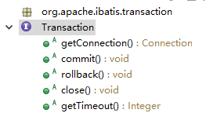
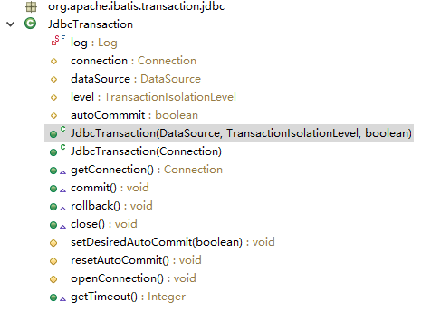

# Mybatis事务机制
---
#### 对数据库的事务而言，具有以下几个操作：创建（create），提交（commit），回滚（rollback），关闭（close）。Mybatis将这些行为抽象为一个Transaction接口。定义如下：

### 一、事务管理的方式
##### Mybatis的事务管理分为以下两种形式：
### 1.使用JDBC的事务管理机制，也就是利用java.sql.Connection对象完成对事务的提交(commit)，回滚(rollback),关闭(close)等操作。

#### 1.1 成员变量
```java
protected Connection connection;  //连接对象
protected DataSource dataSource;  //数据源
protected TransactionIsolationLevel level;  //事务级别
// MEMO: We are aware of the typo. See #941
protected boolean autoCommmit;  //是否自动提交
```
#### 1.2 构造方法
```java
//传递dataSource,level,autoCommmit三个参数
public JdbcTransaction(DataSource ds, TransactionIsolationLevel desiredLevel, boolean desiredAutoCommit) {
    dataSource = ds;
    level = desiredLevel;
    autoCommmit = desiredAutoCommit;
}
//传递Connection一个参数
public JdbcTransaction(Connection connection) {
    this.connection = connection;
}
```
#### 1.3 getConnection()方法
```java
@Override
public Connection getConnection() throws SQLException {
    //  if (connection == null) {
       openConnection();
    //  }
    //  return connection;
}

protected void openConnection() throws SQLException {
    //  if (log.isDebugEnabled()) {
    //    log.debug("Opening JDBC Connection");
    //  }
    //获取Connection
     connection = dataSource.getConnection();
    //  if (level != null) {
      //设置事务级别
       connection.setTransactionIsolation(level.getLevel());
    //  }
    //设置是否自动提交
     setDesiredAutoCommit(autoCommmit);
}

```

### 2.使用MANAGED的事务管理机制:这种机制Mybatis自身不会实现事务管理，是让程序的容器，比如JBOSS，Weblogic等来实现对事务的管理。
#### 2.1 成员变量
```java
private DataSource dataSource;  //数据源
private TransactionIsolationLevel level;  //事务级别
private Connection connection;  //连接对象
private final boolean closeConnection;  //能否关闭连接
```
#### 2.2 构造方法
```java
//传入Connection ，能够关闭连接参数
public ManagedTransaction(Connection connection, boolean closeConnection) {
    this.connection = connection;
    this.closeConnection = closeConnection;
}
//传入数据源，事务级别，能否关闭连接参数
public ManagedTransaction(DataSource ds, TransactionIsolationLevel level, boolean closeConnection) {
    this.dataSource = ds;
    this.level = level;
    this.closeConnection = closeConnection;
}
```
#### 2.3 getConnecton()方法
```java
@Override
public Connection getConnection() throws SQLException {
    // if (this.connection == null) {
      openConnection();
    // }
    // return this.connection;
}
protected void openConnection() throws SQLException {
    //  if (log.isDebugEnabled()) {
    //    log.debug("Opening JDBC Connection");
    //  }
     this.connection = this.dataSource.getConnection();
    //  if (this.level != null) {
       this.connection.setTransactionIsolation(this.level.getLevel());
    //  }
}
```
#### 2.4 close()方法
```java
@Override
public void close() throws SQLException {
     //需要判断能否关闭connection
     if (this.closeConnection && this.connection != null) {
      //  if (log.isDebugEnabled()) {
      //    log.debug("Closing JDBC Connection [" + this.connection + "]");
      //  }
      //  this.connection.close();
     }
}
```
### 二、事务的配置，创建和使用
#### 1. 事务的配置
```xml
<environments default="development">
    <environment id="development">
        <!-- JDBC 使用JDBC管理事务机制 MANAGED 使用WEB容器管理事务 -->
        <transationManager type="JDBC"/>
        <dataSource>
              <property name="driver" value=""/>
              <property name="url" value=""/>
              <property name="username" value=""/>
              <property name="password" value=""/>
        </dataSource>
    </environment>
</environments>
```
### 三、事务工厂的创建
#### XMLConfigBuilder类中获得TransactionFactory
```java
private TransactionFactory transactionManagerElement(XNode context) throws Exception {
      // if (context != null) {
        String type = context.getStringAttribute("type");
        // Properties props = context.getChildrenAsProperties();
        TransactionFactory factory = (TransactionFactory) resolveClass(type).newInstance();
        // factory.setProperties(props);
        // return factory;
      }
      throw new BuilderException("Environment declaration requires a TransactionFactory.");
}
```
#### BaseBuilder类
```java
protected Class<?> resolveAlias(String alias) {
    return typeAliasRegistry.resolveAlias(alias);
}
```
#### TypeAliasRegistry类
##### 是通过TYPE_ALIASES这个map获取到对应的TransactionFactory resolver类的
```java
@SuppressWarnings("unchecked")
 // throws class cast exception as well if types cannot be assigned
public <T> Class<T> resolveAlias(String string) {
    //  try {
    //    if (string == null) {
    //      return null;
    //    }
    //    // issue #748
    //    String key = string.toLowerCase(Locale.ENGLISH);
    //    Class<T> value;
       if (TYPE_ALIASES.containsKey(key)) {
         value = (Class<T>) TYPE_ALIASES.get(key);
       } else {
         value = (Class<T>) Resources.classForName(string);
       }
       return value;
    //  } catch (ClassNotFoundException e) {
    //    throw new TypeException("Could not resolve type alias '" + string + "'.  Cause: " + e, e);
    //  }
}
```
### 四、数据源的创建
##### 数据源的创建和事务工厂的创建基本类似
```java
private DataSourceFactory dataSourceElement(XNode context) throws Exception {
    // if (context != null) {
      String type = context.getStringAttribute("type");
      // Properties props = context.getChildrenAsProperties();
      DataSourceFactory factory = (DataSourceFactory) resolveClass(type).newInstance();
      // factory.setProperties(props);
      // return factory;
    }
    // throw new BuilderException("Environment declaration requires a DataSourceFactory.");
}
```
### 五、环境的建立
##### 环境建立就是建立事务工厂和数据源的过程，生成后的Environment会被设置到Configuration中，供以后使用
```java
//根据TransactionFactory和DataSource实例创建一个Environment对象。
  private void environmentsElement(XNode context) throws Exception {
    if (context != null) {
      //获取当前environment，比如dev
      if (environment == null) {
        environment = context.getStringAttribute("default");
      }
      for (XNode child : context.getChildren()) {
        String id = child.getStringAttribute("id");
        //如果该节点环境与default环境一致
        if (isSpecifiedEnvironment(id)) {
          //1.解析<transactionManager>节点，决定创建什么类型的TransactionFactory
          TransactionFactory txFactory = transactionManagerElement(child.evalNode("transactionManager"));
          //2.创建dataSource
          DataSourceFactory dsFactory = dataSourceElement(child.evalNode("dataSource"));
          DataSource dataSource = dsFactory.getDataSource();
          //3.使用Environment内置的构造器Builder，传递id事务工厂TransactionFactory和数据源DataSource
          Environment.Builder environmentBuilder = new Environment.Builder(id)
              .transactionFactory(txFactory)
              .dataSource(dataSource);
          configuration.setEnvironment(environmentBuilder.build());
        }
      }
    }
}
```

### 六、事务的产生
##### 事务是通过事务工厂产生的
##### JdbcTransactionFactory类，ManagedTransactionFactory
```java
/**
 * 根据给定的数据库连接Connection创建Transaction
 */
@Override
public Transaction newTransaction(Connection conn) {
  return new JdbcTransaction(conn);
}

/**
 * 根据DataSource，隔离级别，是否自动提交创建Transaction
 */
@Override
public Transaction newTransaction(DataSource ds, TransactionIsolationLevel level, boolean autoCommit) {
  return new JdbcTransaction(ds, level, autoCommit);
}
```
