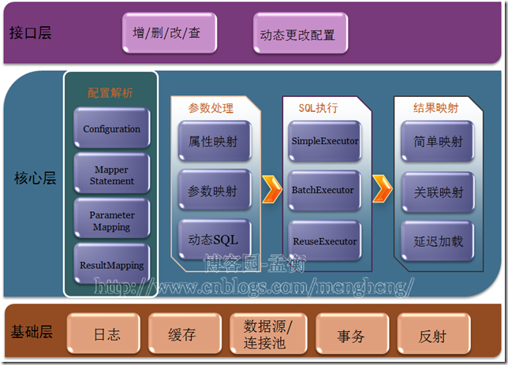
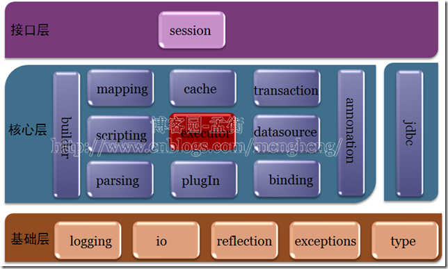

# Mybatis架构分析
---
## 使用体验
### Hibernate体验
之前使用过Hibernate，刚开始使用的时候觉得通过建立对象和数据库表的关系进行增删改查非常方便，一个方法搞定，省掉之间建立连接，拼写sql等等的过程，用起来很爽。

但是后来当业务逻辑变得复杂，不仅仅是简单的增删改查可以满足的时候，可能是我没有把Hibernate学好，所以想完成一个查询或是更新都非常痛苦。当时觉得直接写sql是多么灵活的一件事。

### Mybatis体验
第一次接触Mybatis是在一家实习的公司，当时使用的是SSM架构，第一次看到xml文件时，第一反应就是既然所有sql都要自己写，那用这个东西还有什么意义呢？当时的导师给我解释说写在xml文件中更好管理，更好修改。这个回答目前看来没有什么问题，但是我现在感觉到Mybatis更多地带给我的是一种半自动的良好体验。既能灵活的书写sql，又能自动地为我们做关系到对象的映射，相比于Hibernate，我更喜欢使用Mybatis。

## Mybatis架构
言归正传，本文要总结的是Mybatis的整体架构，我这个菜鸟可总结不出来，主要是参考[http://www.cnblogs.com/mengheng/p/3739610.html](http://www.cnblogs.com/mengheng/p/3739610.html)这篇文章。但是会加一些个人的理解和总结。

功能架构图：

对应的源码架构图:

